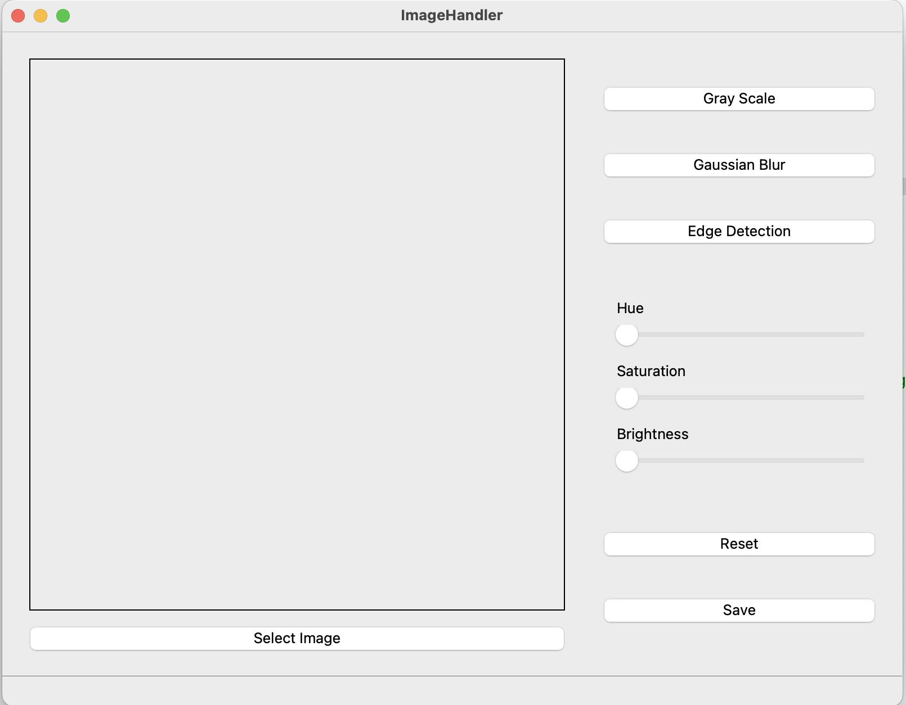
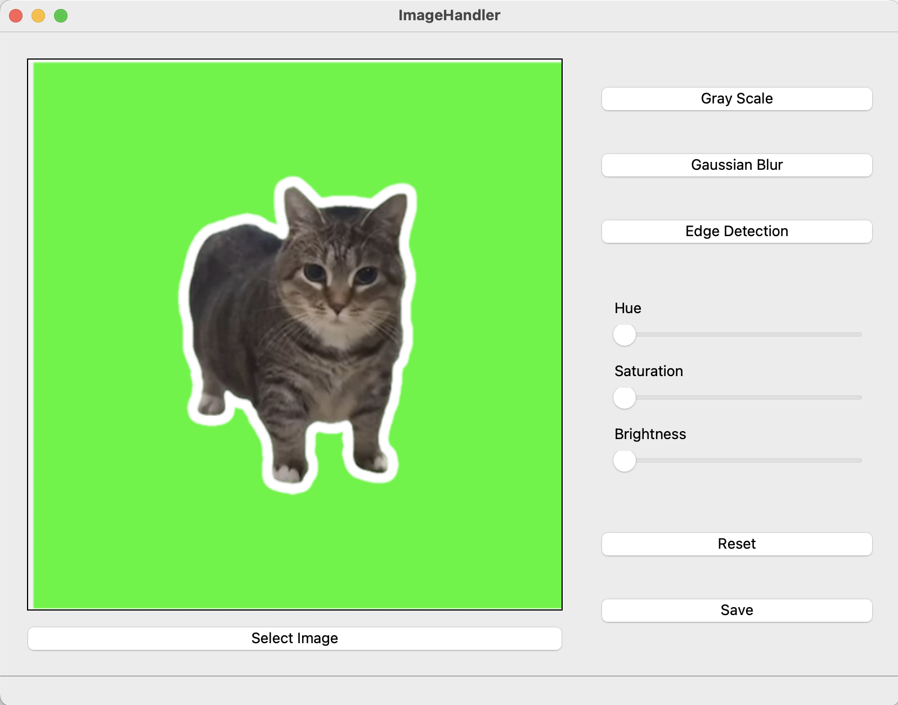
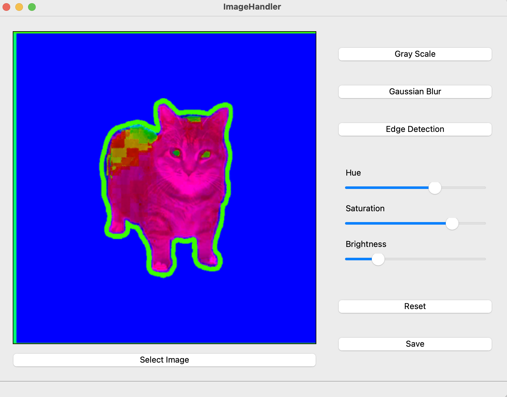
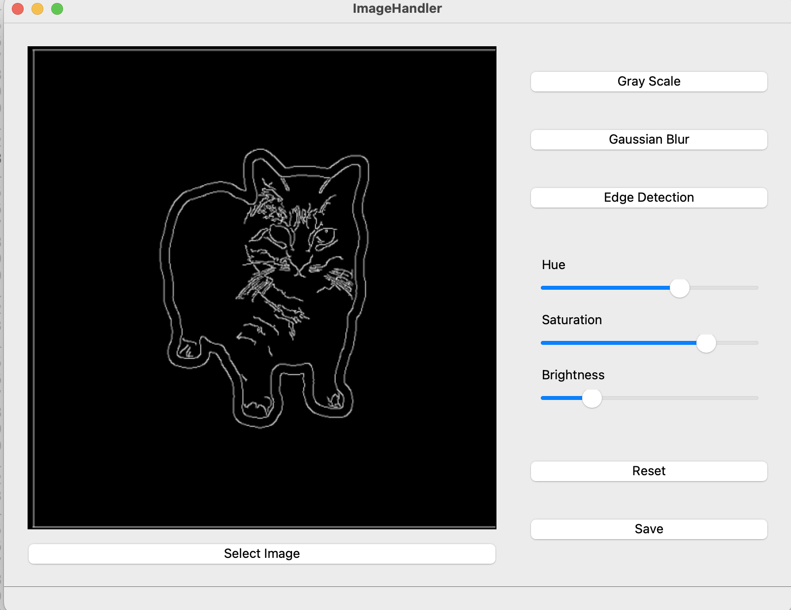

# Image Handler

A simple Qt + OpenCV project for basic image handling:

✅ Load an image  
✅ Convert to grayscale  
✅ Apply Gaussian blur  
✅ Perform edge detection  
✅ Adjust hue, saturation, and brightness via sliders  
✅ Save the edited image  

## 🖼 Screenshots

### 🔹 Initial Interface
！

### 🔹 Load Iamge
！

### 🔹 Slide HSR
！

### 🔹 Edge detection
！


## Usage

1️⃣ Clone the repository  
```bash
git clone https://github.com/ImSISI/imageHandler.git
cd imageHandler
```

2️⃣ Open with Qt Creator or build manually:
mkdir build
cd build
cmake ..
make
./imageHandler
3️⃣ Load an image using the Choose File button.
4️⃣ Try the different buttons and sliders to manipulate your image!
5️⃣ Save your edited image using the Save button.
